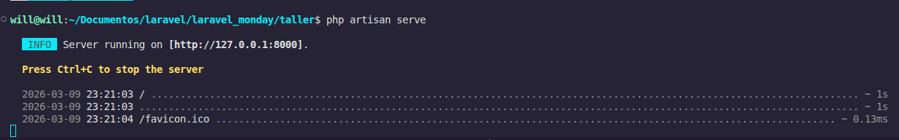
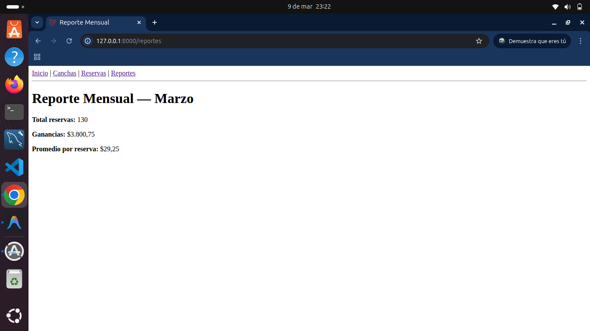
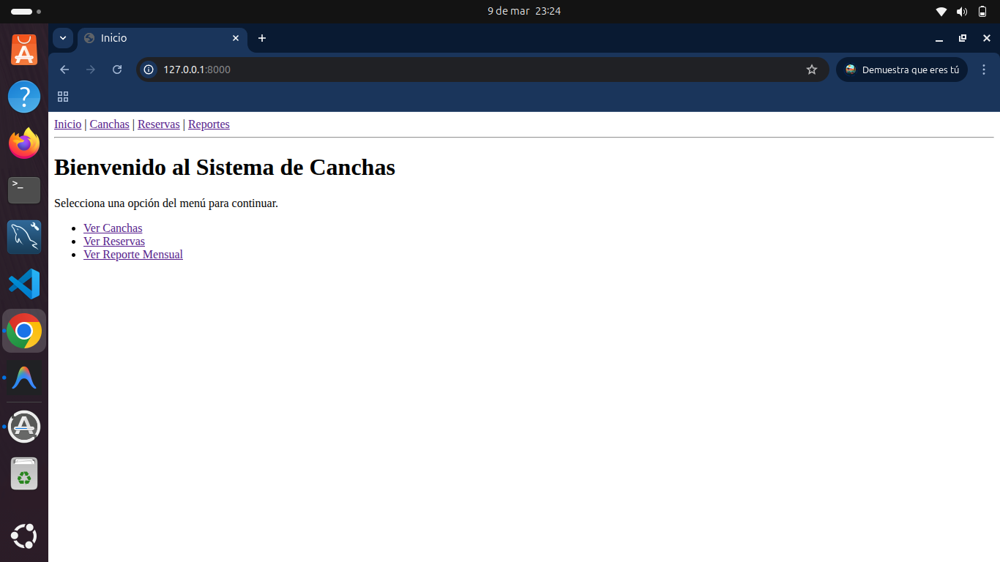

# 🛠️ Taller Laravel — Evidencias y Entregables

Documentación de evidencias del taller de desarrollo con Laravel. Incluye capturas de código, controladores, rutas y vistas Blade implementadas.

---

## ✅ Evidencia Inicial — Servidor corriendo en `http://127.0.0.1:8000`

Confirmación de que el servidor de desarrollo Laravel está activo y el proyecto responde correctamente en el puerto 8000.



---

## 📦 Entregable A — `routes/web.php` funcionando

Rutas registradas correctamente y **sin conflictos de orden**. Se definen rutas para canchas, reservas y reportes apuntando a sus respectivos controladores.

```php
use Illuminate\Support\Facades\Route;
use App\Http\Controllers\CourtController;
use App\Http\Controllers\BookingController;
use App\Http\Controllers\ReportController;

Route::get('/', function () {
    return view('home');
})->name('inicio');

Route::get('canchas',        [CourtController::class,   'index']);
Route::get('canchas/nueva',  [CourtController::class,   'create']);
Route::get('canchas/{id}',   [CourtController::class,   'show']);

Route::get('reservas',       [BookingController::class, 'index']);
Route::get('reservas/crear', [BookingController::class, 'create']);
Route::get('reservas/{id}',  [BookingController::class, 'show']);

Route::get('reportes',       [ReportController::class,  'monthlyReport']);
```

---

## 📦 Entregable B — Los 3 controladores operativos

Los controladores tienen sus métodos implementados y retornan las vistas correspondientes.

### 🎾 CourtController

Maneja el listado, creación y visualización de canchas. Usa datos simulados en un array privado `$canchas`.

```php
namespace App\Http\Controllers;

class CourtController extends Controller
{
    private $canchas = [
        ['nombre' => 'Cancha 1: Tenis A', 'tipo' => 'Tenis',   'precioHora' => 25000],
        ['nombre' => 'Cancha 2: Fútbol 5','tipo' => 'Fútbol',  'precioHora' => 90000],
        ['nombre' => 'Cancha 3: Tenis B', 'tipo' => 'Tenis',   'precioHora' => 22000],
    ];

    public function index()  { return view('courts.index', ['canchas' => $this->canchas]); }
    public function create() { return view('courts.create'); }
    public function show($id){ return view('courts.show',  ['cancha' => $this->canchas[$id]]); }
}
```

### 📊 ReportController

Genera reportes mensuales con datos de reservas, ganancias y promedios por mes.

```php
namespace App\Http\Controllers;

class ReportController extends Controller
{
    private $resumenMes = [
        'enero'   => ['reservas' => 120, 'ganancias' => 3500.50, 'promedio' => 29.17],
        'febrero' => ['reservas' => 145, 'ganancias' => 4200.00, 'promedio' => 28.96],
        'marzo'   => ['reservas' => 130, 'ganancias' => 3800.75, 'promedio' => 25.25],
    ];

    public function monthlyReport(?string $mes = null)
    {
        $mes = $mes ?? 'marzo';
        return view('reports.show', ['resumenMes' => $this->resumenMes[$mes]]);
    }
}
```



---

### 📅 BookingController

Gestiona las reservas del sistema. Almacena datos simulados con id, cancha, fecha, hora y cliente.

```php
namespace App\Http\Controllers;

class BookingController extends Controller
{
    private $reservas = [
        ['id' => 101, 'cancha' => 'Tenis A',   'fecha' => '2026-03-05', 'hora' => '18:00', 'cliente' => 'Luis'],
        ['id' => 102, 'cancha' => 'Fútbol 5',  'fecha' => '2026-03-06', 'hora' => '19:00', 'cliente' => 'Marta'],
        ['id' => 103, 'cancha' => 'Padel B',   'fecha' => '2026-03-07', 'hora' => '20:00', 'cliente' => 'Carlos'],
    ];

    public function index()  { return view('bookings.index', ['reservas' => $this->reservas]); }
    public function create() { return view('bookings.create'); }
    public function show($id){ return view('bookings.show',  ['reserva' => $this->reservas[$id]]); }
}
```

## 📦 Entregable C — Layout con menú funcional

El layout principal (`app.blade.php`) incluye una barra de navegación y sidebar con enlaces generados con `url()`, permitiendo navegar entre secciones **sin escribir URLs manualmente**.

```php
<!DOCTYPE html>
<html lang="es">

<head>
    <meta charset="UTF-8">
    <meta name="viewport" content="width=device-width, initial-scale=1.0">
    <title>@yield('title', 'Sistema de Canchas')</title>
</head>

<body>

    <nav>
        <a href="{{ route('inicio') }}">Inicio</a> |
        <a href="{{ route('canchas.index') }}">Canchas</a> |
        <a href="{{ route('reservas.index') }}">Reservas</a> |
        <a href="{{ route('reportes.monthly') }}">Reportes</a>
    </nav>

    <hr>

    <main>
        @yield('content')
    </main>

</body>

</html>
```



---

## 📦 Entregable D — Uso de `@foreach` y `@if` en Blade

### Vista `courts/index.blade.php` — `@foreach` con canchas

Itera sobre el array de canchas y muestra nombre, tipo, precio y un botón "Ver".

```php
@extends('layouts.app')

@section('title', 'Canchas')

@section('content')
<h1>Lista de Canchas</h1>

<a href="{{ route('canchas.create') }}">Nueva Cancha</a>

@if(empty($canchas))
<p>No hay canchas registradas.</p>
@else
<table border="1" cellpadding="5" cellspacing="0">
    <thead>
        <tr>
            <th>#</th>
            <th>Nombre</th>
            <th>Tipo</th>
            <th>Precio / hora</th>
            <th>Acciones</th>
        </tr>
    </thead>
    <tbody>
        @foreach($canchas as $i => $cancha)
        <tr>
            <td>{{ $i + 1 }}</td>
            <td>{{ $cancha['nombre'] }}</td>
            <td>{{ $cancha['tipo'] }}</td>
            <td>${{ number_format($cancha['precioHora'], 0, ',', '.') }}</td>
            <td>
                <a href="{{ route('canchas.show', $i) }}">Ver</a>
            </td>
        </tr>
        @endforeach
    </tbody>
</table>
@endif
@endsection
```


---

### Vista `bookings/index.blade.php` — `@foreach` + `@if` con reservas

Itera sobre reservas y usa `@if` para asignar dinámicamente la clase CSS del badge de estado (`confirmada`, `cancelada`, `pendiente`).

```php
@extends('layouts.app')

@section('title', 'Reservas')

@section('content')
<h1>Reservas</h1>

<a href="{{ route('reservas.create') }}">Nueva Reserva</a>

@php $reservas = $reservas ?? []; @endphp

@if(empty($reservas))
<p>No hay reservas registradas.</p>
@else
<table border="1" cellpadding="5" cellspacing="0">
    <thead>
        <tr>
            <th>
            <th>Cliente</th>
            <th>Cancha</th>
            <th>Fecha</th>
            <th>Hora</th>
            <th>Total</th>
            <th>Estado</th>
            <th>Acciones</th>
        </tr>
    </thead>
    <tbody>
        @foreach($reservas as $i => $reserva)
        <tr>
            <td>{{ $i + 1 }}</td>
            <td>{{ $reserva['cliente'] }}</td>
            <td>{{ $reserva['cancha'] }}</td>
            <td>{{ $reserva['fecha'] }}</td>
            <td>{{ $reserva['hora'] }}</td>
            <td>${{ number_format($reserva['total'] ?? 0, 0, ',', '.') }}</td>
            <td>{{ ucfirst($reserva['estado'] ?? 'pendiente') }}</td>
            <td>
                <a href="{{ route('reservas.show', $i) }}">Ver</a>
            </td>
        </tr>
        @endforeach
    </tbody>
</table>
@endif
@endsection
---
